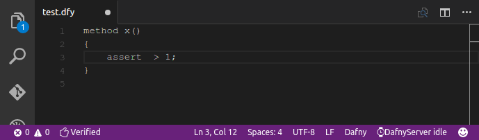

# dafny-vscode

Dafny support for Visual Studio Code.
Requires a binary distribution of DafnyServer, and mono on non-windows platforms; see installation guide below.

## Features

* Provides .dfy language id to vscode.
* Spawns a DafnyServer in the background and sends veification requests upon opening and saving Dafny files.
* Errors, warnings and hints are shown through the vscode interface. When there are no errors, you get a thumbup on the status bar.

## Requirements

* A C# runtime. Mono should be supported on all platforms that vscode runs on. On windows, you may also use .net - see config below.
* [Binary dafny distribution](https://github.com/Microsoft/dafny/releases), which contains `DafnyServer.exe` and its dependencies - path must be specified in config.

## Extension Settings

The following are necessary:

* `dafny.dafnyServerPath`: absolute `DafnyServer.exe` path.

The following are optional:

* `dafny.monoPath`: Absolute path to mono binary. Only required if mono isn't at `/usr/bin/mono`.
* `dafny.useMono`: Only applicable to Windows; requires .net 4.0 or higher when false. Attempts to launch dafny process directly when set to false 

[//]: # "* `dafny.automaticVerification`: Verify as soon as the document is changed (default). When false, only verify on save."
[//]: # "* `dafny.automaticVerificationDelayMS`: Delay to wait after a document change before actually sending a verification request. This is done to avoid * getting syntax errors as one is typing. Only relevant when automaticVerification is true."

## Release Notes

### 0.0.2
Fixed readme and license, added use animation.

### 0.0.1
Initial release, some half baked features turned off.

## TODO
* get mono from path if available.
* atomatic verification as one types (with 'deboucing' waiting period).
* syntax highlighting (see if you can adapt sublime-dafny).
* context aware suggestiions.
* full context awareness, code completion.