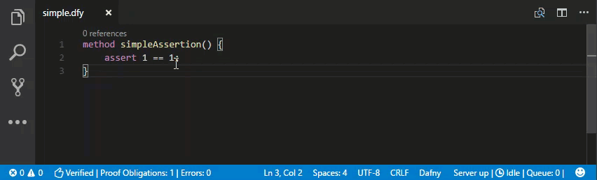

# Dafny-VSCode
Dafny support for Visual Studio Code.

## Features

* Provides .dfy language support to vscode.
* Automatic installation of Dafny
* Update notification if there is a newer release of Dafny. 
* Automatic verification as one types
  * Errors, warnings and hints are shown through the vscode interface.
  * When there are no errors, you get a thumbsup on the status bar
* Display counter examples for failing proofs
* CodeLens showing method references
* IntelliSense for classes
* Compile and Run dfy file
* Syntax highlighting thanks to [sublime-dafny](https://github.com/erggo/sublime-dafny). See file `LICENSE_sublime-dafny.rst` for license. 
* Left hand side status bar item provides information about the current file.
* Right hand size status bar item relates to the state of the DafnyServer.
* DafnyDefinition provider to support refactorings in the future 

More examples at the end...

## Shortcuts

* `Ctrl+Shift+B` or `⇧⌘B` Compile dfy file to dll or exe, if there is a Main method
* `F5` Compile and Run if the source file has a Main method. 
* `F6` Show Flow graph
* `F7` Show CounterExample
* `F8` Hide CounterExample

## Tasks

* `Install DafnyServer` Download and install the dafnyserver and sets the dafny.dafnyServerPath accordingly
* `Uninstall DafnyServer` Uninstalls the DafnyServer
* `Restart DafnyServer` Restart the DafnyServer

## Installation guide

* The plugin needs a C# runtime to run the Dafny server. In case you do not have one, please download one from [Mono](http://www.mono-project.com).
* Install the Dafny VSCode extension from the [Visual Studio Marketplace](https://marketplace.visualstudio.com/items?itemName=FunctionalCorrectness.dafny-vscode#overview). When you first open a Dafny file, the extension will prompt you to automatically install Dafny.
* In case you would like the plugin to use a different [Dafny distribution](https://github.com/FunctionalCorrectness/dafny-microsoft/releases), set the path to the `DafnyServer.exe` file via the `dafny.dafnyServerPath` user setting.

## Extension Settings

The following are necessary:

* `dafny.basePath`: absolute path to the **Dafny Directory**. 

The following are optional:

* `dafny.monoPath`: Absolute path to `mono` binary. Only required if `mono` isn't found in PATH (you'll get an error if that's the case).

* `dafny.useMono`: Only applicable to Windows; requires .net 4.0 or higher when false. Attempts to launch dafny process directly when set to false 

* `dafny.automaticVerification`: Verify as soon as the document is changed (default). When false, only verify on save.

* `dafny.automaticVerificationDelayMS`: Delay to wait after a document change before actually sending a verification request. This is done to avoid getting syntax errors as one is typing. Only relevant when automaticVerification is true.

* `dafny.automaticShowCounterModel`: Show CounterModel automatically if a proof fails. Can cause performance issues.

# Contributing

We welcome all contributions! Please create a pull request and we will take care of releasing a new version when appropriate.

## How-To

It is pretty simple to contribute to this plugin. All it takes is having Visual Studio Code and npm installed. Simply clone this repository and switch into the new folder. Execute the following commands:

* `cd server`
* `npm install`
* `code .`
* `cd ../client`
* `npm install`
* `code .`

This opens the language server part and the client part of the plugin in two different Visual Studio Code editors and installs all the dependencies. In the server editor, press `CTRL + Shift + b` to compile. The task that is started also watches file changes and recompiles automatically after saving.

To try out the changes, go to the client editor and press `F5`. A new instance of Visual Studio Code will be started that has the Dafny plugin running and ready for testing. Sometimes, Visual Studio Code does not recognize changes and does not apply them to the running test instance. If this is the case, simply close and restart the test instance, the changes should then be applied.

If you wish to contribute, simply make your changes and submit a pull request. Make sure that your changes don't break the existing tests in the client/test folder. You can run the tests with `npm test` while in the client folder. Feel free to add any tests.

If you need to change the DafnyServer itself, which should not often be the case, check with [Microsoft Dafny](https://github.com/Microsoft/dafny) in order to integrate your changes.

