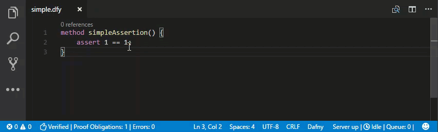
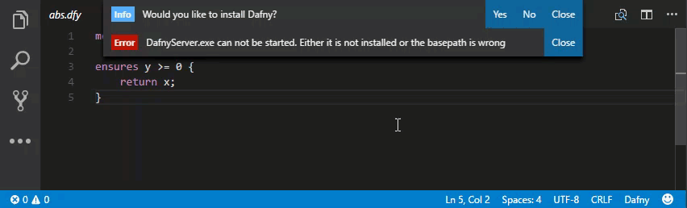
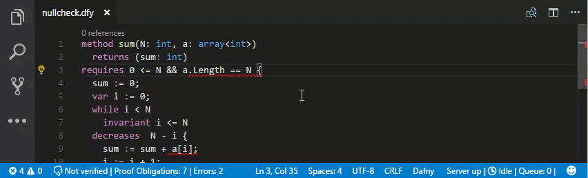
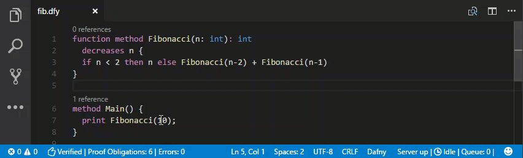
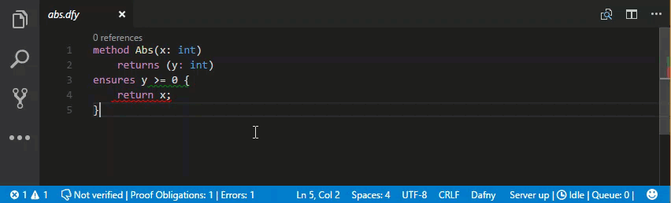

# Dafny VSCode Extension

This extension adds the support of _Dafny_ to Visual Studio Code.

## Features

* Provides `.dfy` language support to VSCode.
* Automatic installation of _Dafny_.
* Compile and run `.dfy` files.
* Automatic verification as one types.
* Errors, warnings and hints are shown through the VSCode interface. When there are no errors, you get a :thumbsup: on the status bar.
* Spawns a _DafnyServer_ in the background and sends verification requests upon opening and saving _Dafny_ files.
* Context menu for most commands.
* Left hand side status bar item provides information about the current file.
* Right hand size status bar item relates to the state of the _DafnyServer_.
* _IntelliSense_ for classes.
* _CodeLens_ showing method references.
* Shows warning if the _Dafny_ plugin is used without a workspace. Can cause features to not work correctly.
* Display counter example for failing proof (requires _Dafny_ 1.9.15+).
* _CounterExamples_ are not shown directly. You can set `dafny.automaticShowCounterModel` to true or use `F7`.
* Syntax highlighting thanks to [sublime-dafny](https://github.com/erggo/sublime-dafny). See file `LICENSE_sublime-dafny.rst` for license. 
* _DafnyDefinition_ provider to support refactorings in the future.
* Update notification if there is a newer release of _Dafny_.

More examples at the end...

## Shortcuts

| Shortcut                  | Description                                                          |
| :------------------------ |:-------------------------------------------------------------------- | 
| `Ctrl+Shift+B` or `⇧+⌘+B` | Compile `.dfy` file to `.dll` or `.exe`, if there is a `Main` method |
| `F5`                      | Compile and run, if the source file has a `Main` method              |
| `F6`                      | Show flow graph                                                      |
| `F7`                      | Show _CounterExample_                                                |
| `F8`                      | Hide _CounterExample_                                                |

## Tasks

Choose `Tasks -> Run Task...` to run one of the following:

| Task                    | Description                                                                               |
| :---------------------- |:----------------------------------------------------------------------------------------- | 
| `Install DafnyServer`   | Downloads and installs the _DafnyServer_ and sets the `dafny.dafnyServerPath accordingly` |
| `Uninstall DafnyServer` | Uninstalls the _DafnyServer_                                                              |
| `Restart DafnyServer`   | Restarts the _DafnyServer_                                                                |

## Requirements

* The plugin needs a _C#_ runtime to run the _DafnyServer_. In case you do not have one, please download one from [Mono](http://www.mono-project.com).
* In case you would like the plugin to use a different _Dafny_ distribution, set the path to the `DafnyServer.exe` file via the `dafny.dafnyServerPath` user setting.
* Note: When you first open a _Dafny_ file, the extension will prompt you to automatically install _Dafny_.

## Extension Settings

The following are necessary:

| Setting          | Description                             |
| :--------------- |:--------------------------------------- |
| `dafny.basePath` | Absolute path to the _Dafny_ directory. |

The following are optional:

| Setting          | Description                              |
| :--------------- |:---------------------------------------- |
| `dafny.monoPath` | Absolute path to `mono` binary. Only required if `mono` isn't found in _PATH_ (you'll get an error if that's the case). |
| `dafny.useMono` | Only applicable to _Windows_! Requires _.NET_ 4.0 or higher when set to false. Attempts to launch dafny process directly, when set to false. |
| `dafny.automaticVerification` | Verify as soon as the document is changed (default). When false, only verify on save. |
| `dafny.automaticVerificationDelayMS` | Delay to wait after a document change before actually sending a verification request. This is done to avoid getting syntax errors as one is typing. Only relevant when automaticVerification is true. |
| `dafny.automaticShowCounterModel` | Show _CounterModel_ automatically if a proof fails. Can cause performance issues. |

## Examples

### Installation
On the first start the plugin asks you to install _Dafny_ automatically. 

### Add null check
Some diagnostics can be directly inserted with a quickfix at the beginning of a line.

### Compile and Run
Pressed `F5` to compile and run the program.

### Show Counter Example
Pressed `F7` to show counter examples.

## Contribute

This is an open-source project that lives from coding contributions. We welcome your help! For a description of how you can contribute, as well as a list of issues you can work on, please visit the [Dafny-VSCode GitHub site](https://github.com/DafnyVSCode/Dafny-VSCode).